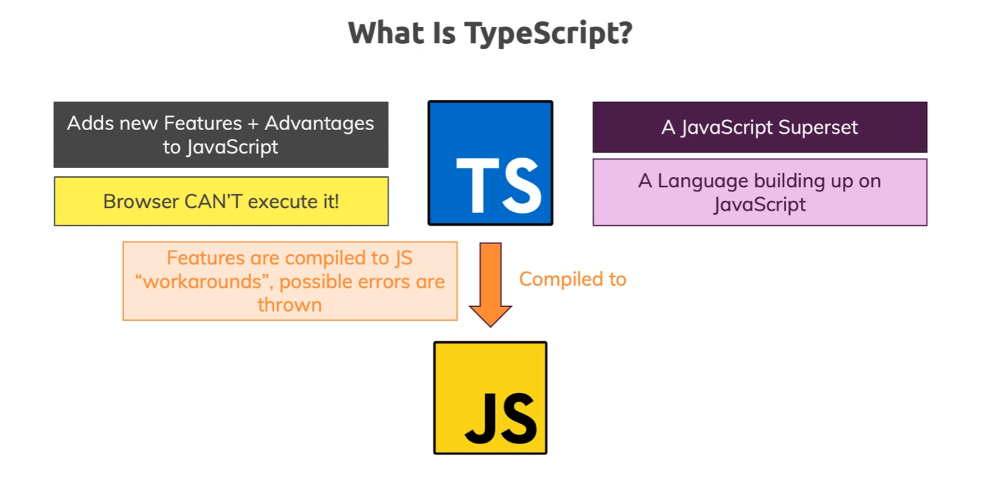
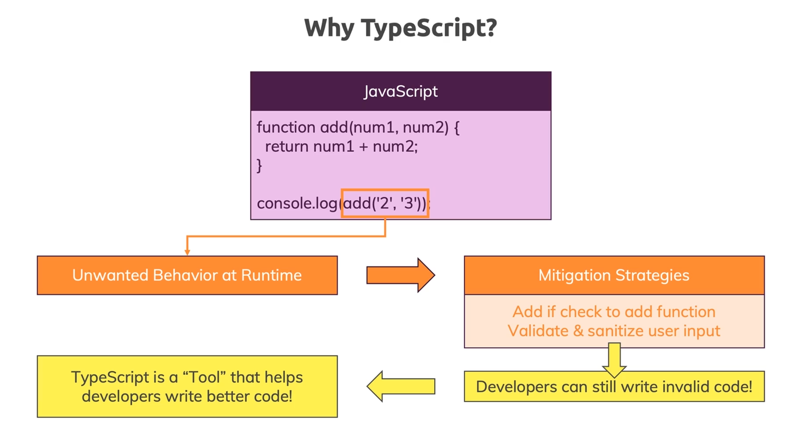
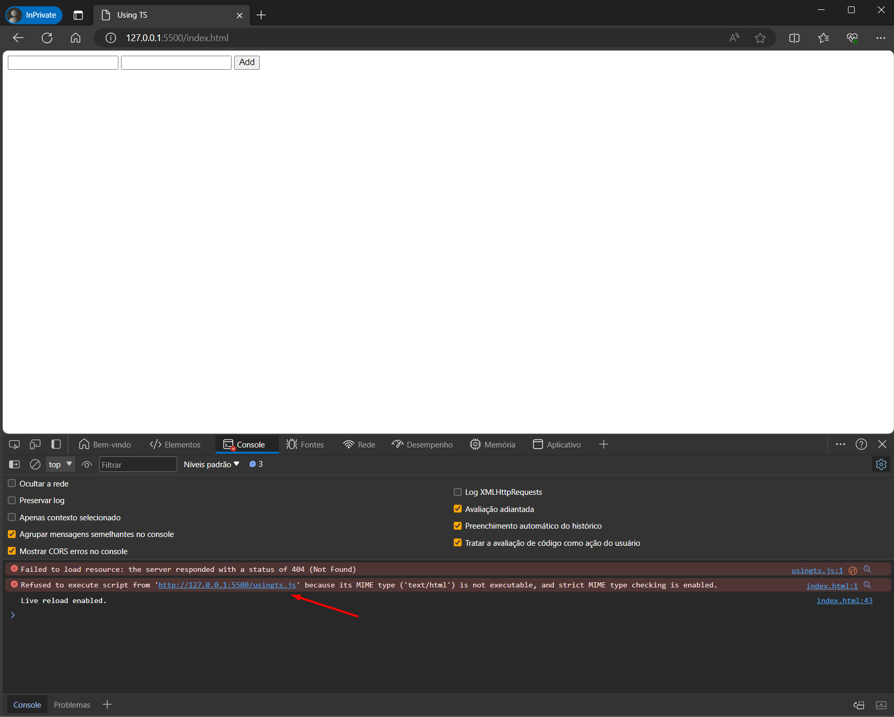
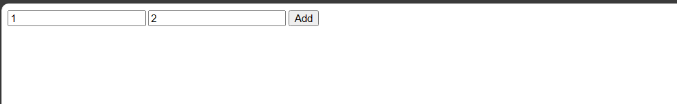
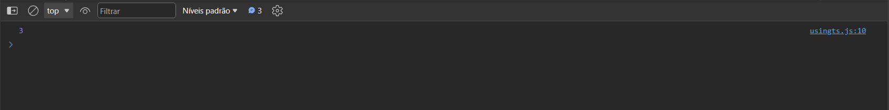

# Chapter 1: Getting Started

- [Chapter 1: Getting Started](#chapter-1-getting-started)
  - [What is TypeScript?](#what-is-typescript)
  - [Why TypeScript?](#why-typescript)
  - [Setting Up a Code Editor / IDE](#setting-up-a-code-editor--ide)
  - [Installing and using TypeScript](#installing-and-using-typescript)
  - [TypeScript Advantages](#typescript-advantages)

## What is TypeScript?

Typescript is a superset for JavaScript.

> [!NOTE] 
> "TypeScript stands in an unusual relationship to JavaScript. TypeScript offers all of JavaScript’s features, and an additional layer on top of these: TypeScript’s type system." [TypeScript for JavaScript Programmers](https://www.typescriptlang.org/docs/handbook/typescript-in-5-minutes.html)

- It's not a new programming language.
- Instead it takes JavaScript and add new features.
- Makes writing JS code more powerful.
- Browsers **can't** execute TypeScript!
- Your code is compiled into JavaScript so the browser can execute it.
- Adds types to your code lowering the chance of bugs.



## Why TypeScript?

- Adds static types to JavaScript. JS is a dynamic typed language. Dynamic typed languages are usually more error prone.
- Avoid type errors and unwanted behavior
- Write better code

**Example**: JavaScript will concatenate the values, instead of adding the values, when someone passes strings to the function instead of numbers.



To avoid this, developers should add validation and sanitization code. With TypeScript, you write better code from start.

## Setting Up a Code Editor / IDE

- [x] Download [Visual Studio Code](https://code.visualstudio.com/)
- [x] Download extensions
  - ESLint
  - Path Intellisense
  - Prettier
- [x] Install [Node.js](https://nodejs.org/en) (required to use npm commands to install TypeScript and libraries.

## Installing and using TypeScript

To install TypeScript follow the steps bellow:

1.  Create a folder for your project in another path different from this repo. This will be your project root folder.

    ```bash
    mkdir my_ts_project
    ```

2.  Enter your project root folder.

    ```bash
    cd my_ts_project
    ```

3.  Create a Node.js project with the following command.

    ```bash
    npm init
    ```

4.  You will be prompted to answer a lot of questions. Just press enter for all of them. In the end confirm with Yes.
5.  NPM will create a package.json file. This file saves your project dependencies so you can install it later in another machine or for sharing your project with your team.
6.  In your terminal type

    ```bash
    npm install typescript --save-dev
    ```

> [!IMPORTANT] 
> Node.js is required to use the node package manager (npm). Other install options at [Download TypeScript](https://www.typescriptlang.org/download). You can learn more about installing packages with npm at npm-install.

7.  NPM will download TypeScript library inside your project folder under the node_modules file.
8.  Open your project folder in VSCode.

    ```bash
    code .
    ```

9.  Create a TypeScript file (any filename with .ts extension). Example. `using_ts.ts`
10. Type the following code into your file.

    ```TypeScript
      const button = document.getElementById('add')! as HTMLButtonElement;
      const input1 = document.getElementById('num1')! as HTMLInputElement;
      const input2 = document.getElementById('num2')! as HTMLInputElement;

      function add(num1: number, num2: number) {
        return num1 + num2;
      }

      if (button) {
        button.addEventListener('click', function () {
          console.log(add(+input1.value, +input2.value));
        });
      }
    ```

    So, here's the changes TypeScript needs for our code to work:

    a. The function parameters must be declared with a type, in case, number.

    b. The exclamation marks after the functions tells TypeScript that we know that the elements exists in the page (so they won't be null).

    c. The input elements are declared with the `as` keyword followed by `HTMLInputElement`, as well as the `HTMLButtonElement`, to tell TypeScript that they will be treated as form input element and not just a generic element type.

    d. Input values are always strings, so we need to add a plus sign in front of each parameter to convert them into number.

11. Create an index.html file with two input text and a button as bellow.

    ```html
    <!DOCTYPE html>
    <html lang="en">
      <head>
        <meta charset="UTF-8" />
        <meta name="viewport" content="width=device-width, initial-scale=1.0" />
        <title>Using TS</title>
      </head>
      <body>
        <input type="text" name="num1" id="num1" />
        <input type="text" name="num2" id="num2" />
        <button id="add">Add</button>
        <script src="using_ts.js"></script>
      </body>
    </html>
    ```

> [!NOTE] 
> The html file should load a .js (JavaScript) file not .ts (TypeScript).

12. Open the index.html file in the Browser.
13. Open the JavaScript console by pressing Ctrl + Shift + J.
14. You will see an error telling the JavaScript file your mentioned doesn't exists. 
15. Now, for our code to work, we need to compile the TypeScript source.

    ```bash
    tsc using_ts.ts
    ```
> [!NOTE]
> If your get errors trying to compile, please check the [Chapter 3 - Compiling TypeScript](../Chapter-03/README.md#compiling-typescript) section.

16. You will see a file with the same name but a different extension. E.g. using_ts.js. This is our TypeScript source compiled into JavaScript.
17. Now try to open the index.html file again in your browser and test the page. 

    Test the page, for instance, typing 1 an 2 an then clicking the add button.

18. You can check the results in the console.

    

What we did was:

1. Created an HTML `index.html`file to serve as our application
2. Created a TypeScript file `using_ts.ts` to start writing our code.
3. Then we “transpiled” (it means, translate the TypeScript file into pure JavaScript) the file.
4. This way the browser can execute our code as it was plain old JavaScript.

So what’s the point of using TypeScript in this context?

- If we use pure JavaScript, when we add two input field values, instead of a sum (1 + 2 = 3) we would get a string concatenation (1 + 2 = 12).
- With TypeScript we can specify the type of the variables and parameters we expect to receive:
  ```TypeScript
  function add(num1: number, num2: number) {
    return num1 + num2;
  }
  ```
- TypeScript will infer an try to convert the values if possible, otherwise we would get an error.
- And this prevent us to write code that is error prone.
- As a _strongly typed language,_ TypeScript help us to know the expected behavior of our code ahead of the runtime.
- In JavaScript, to prevent the error we would need to write extra code for checking variable types and handling user input errors.
  ```TypeScript
  function add(num1, num2) {
  	if (typeof num1 === "number" && type of num2 === "number" {
  	  return num1 + num2;
  	} else {
  		return +num1 + +num2;
  	}
  }
  ```
- We can check that the resulting JavaScript code did this to us when we transpiled.

## TypeScript Advantages

Overall, these are the main advantages with TypeScript:

- Add types
  - Auto-completion on IDEs
  - Show errors before compiling the code
  - Prevent errors
- Next-gen JavaScript Features (compiled down for older Browsers)
- Non-JavaScript Features like Interfaces or Generics
- Meta-Programming Features like Decorators
- Rich Configuration Options
- Modern Tooling that helps even in non-TypeScript Projects

---

[[<< Previous]](../README.md) [[^Top]](#chapter-1-getting-started) [[Next >>]](../Chapter-02/README.md)
