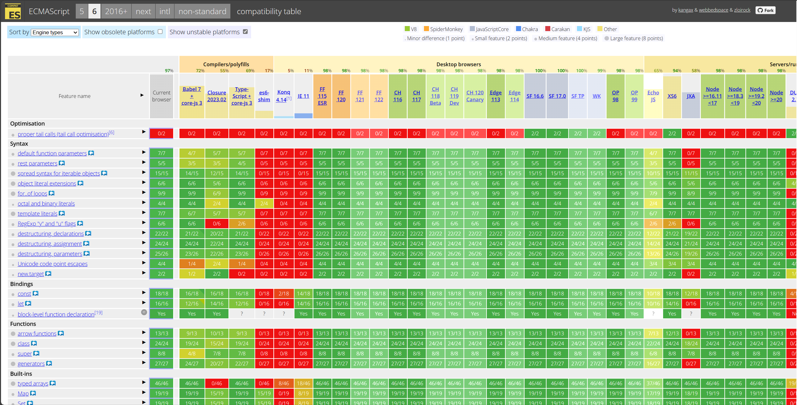

# Chapter 4 : Next-generation JavaScript & TypeScript

- [Chapter 4 : Next-generation JavaScript \& TypeScript](#chapter-4--next-generation-javascript--typescript)
  - [The History of JavaScript](#the-history-of-javascript)
  - [JavaScript Compatibility Matrix](#javascript-compatibility-matrix)
  - [`var`, `let` and `const`](#var-let-and-const)
  - [Arrow Functions](#arrow-functions)
  - [Default Parameters in JavaScript](#default-parameters-in-javascript)
  - [The Spread Operator](#the-spread-operator)

## The History of JavaScript

JavaScript, initially named Mocha and later renamed to LiveScript, was introduced in December 1995 with the release of Netscape Navigator 2.0 Beta 3 
. It was developed independently from Java, despite the similar name. In November 1996, Netscape submitted JavaScript to Ecma International, leading to the release of the first ECMAScript language specification in June 1997 
. Since then, JavaScript has evolved significantly, with new versions and features being introduced over the years.

**Versions of JavaScript**
1. **ECMAScript 5 (ES5) (2009)**: ES5 introduced several major changes and new features to JavaScript. Notable additions include strict mode, which enforces stricter syntax rules, and new array methods that made working with arrays easier.
2. **ECMAScript 6 (ES6) (2015)**: Also known as ECMAScript 2015, ES6 was a significant update that fulfilled many promises of ECMAScript 4. It introduced features like arrow functions, classes, modules, and enhanced object literals.
3. **ECMAScript 2016 (ES2016)**: This version was the first yearly release of ECMAScript. It had a shorter release cycle compared to ES6, resulting in fewer new features.
4. **ECMAScript 2017 (ES2017)**: The second yearly release of ECMAScript, ES2017 introduced new features such as async/await, shared memory, and atomics.
5. **ECMAScript 2018 (ES2018)**: ES2018 brought new features like asynchronous iteration, rest/spread properties, and Promise.prototype.finally.
6. **ECMAScript 2019 (ES2019)**: ES2019 introduced features like Array.prototype.flat, Array.prototype.flatMap, and Object.fromEntries.
7. **ECMAScript 2020 (ES2020)**: ES2020 introduced features like optional chaining (?.), nullish coalescing operator (??), and BigInt data type.
8. **ECMAScript 2021 (ES2021)**: ES2021 introduced features like String.prototype.replaceAll, Promise.any, and Logical Assignment Operators (||=, &&=, ??=).
9. **ECMAScript 2022 (ES2022)**: ES2022 is the latest version of ECMAScript. It introduced features like class fields, private methods, and numeric separators.
10. **ECMAScript 2023 (ES2023)**: Introduced new array methods such as findLast, findLastIndex, toReverse, toSorted, toSpliced, etc.
11. **ECMAScript 2024 (ES2024)**: There is no information available about the features and changes introduced in ES2024.

Please note that ECMAScript versions are released once per year and include all features that have reached stage 4 prior to the release deadline. This results in smaller, incremental releases with field-tested features.

It's important to mention that the JavaScript language specification is known as ECMAScript (ECMA-262).

**Summary of Changes and Features**:

- ES5 introduced strict mode, new array methods, and other improvements.
- ES6 (ES2015) introduced arrow functions, classes, modules, and enhanced object literals.
- ES2016 had fewer new features compared to ES6 due to a shorter release cycle.
- ES2017 introduced async/await, shared memory, and atomics.
- ES2018 brought asynchronous iteration, rest/spread properties, and Promise.prototype.finally.
- ES2019 introduced Array.prototype.flat, Array.prototype.flatMap, and Object.fromEntries.
- ES2020 introduced optional chaining (?.), nullish coalescing operator (??), and BigInt data type.
- ES2021 introduced String.prototype.replaceAll, Promise.any, and Logical Assignment Operators (||=, &&=, ??=).
- ES2022 introduced class fields, private methods, and numeric separators.

What we call Next-generation JavaScript, is a set of language features (ES6 and above), syntax and capabilities that has significantly improved JavaScript over the years, giving JS code a new status in the developers community to broadly hated to massively used. 

More than that, some of these new features turned out to be a reference for other languages that now have to, at least, provide something similar if they want to welcome new developers used to Next-gen JS.


## JavaScript Compatibility Matrix


https://compat-table.github.io/compat-table/es6/

This matrix show all JavaScript features, in a given version, and tells what is compatible with runtime engines (browser or server). This is handy to know what version of JavaScript you should be running regarding your target runtime, and what features are available or not. 

When using TypeScript, it is good to check this matrix before defining the `target` option in your tsconfig.json. 

## `var`, `let` and `const`

In JavaScript, there are three keywords used for variable declaration: var, let, and const. Each of these keywords has its own characteristics and use cases.

**Var**:

- `var` is the oldest method of declaring variables in JavaScript.
Variables declared with var are function-scoped, meaning they are accessible within the function in which they are declared.
- `var` variables are hoisted, which means they can be accessed before they are declared, but they are initialized with the value undefined.
- `var` variables can be redeclared and reassigned within their scope.
- However, using var can lead to issues like variable hoisting and global scope pollution, which is why it is recommended to use let and const instead.

Examples:

1. Function-scoped variable
    ```JavaScript

    function add(a: number, b: number) {
      var result; //result declared inside a function
      result = a + b; 
      return result;
    }

    console.log(result); // This will give an error
    ```

2. Globally defined variable
    ```JavaScript
    var result;

    function add(a: number, b: number) {
      result = a + b; //result can be accessed here
      return result;
    }

    console.log(result);
    ```

**Let**:

- `let` was introduced in ECMAScript 2015 (ES6) as a replacement for var.
Variables declared with let are block-scoped, meaning they are accessible within the block in which they are declared.
- `let` variables are not hoisted, so they cannot be accessed before they are declared.
- `let` variables can be reassigned within their scope, but they cannot be redeclared in the same scope.
- Using let helps prevent unintended variable leakage and makes the code easier to understand.

Examples:

1. If var is declared inside a block statement, e.g. if, for, while, etc. it  will be available outside the block scope

    ```JavaScript
    var age = 30
    if (age > 20) {
      var isOld = true;
    }
    console.log(isOld); // we can access isOld here.
    ```


2. With let declared inside a block scope, it will not be available outside the block statement.
    ```JavaScript
    var age = 30
    if (age > 20) {
      let isOld = true;
    }
    console.log(isOld); // can't access isOld here
    ```

3. Like var, let can be reassigned a value
    ```JavaScript
    let age = 30
    let isOld = false;
    if (age > 20) {
      isOld = true;
    }
    console.log(isOld); // this will print true
    ```

> [!TIP]
> `let` is less error prone, since it will prevent accidentally accessing or 
> changing values outside the scope it is declared. Most developers will use let
> instead of var as a code best practice.

**Const**:

- `const` was also introduced in ECMAScript 2015 (ES6).
- Variables declared with const are block-scoped and have the same scoping rules as let.
- The main difference is that const variables are read-only and cannot be reassigned once they are assigned a value.
- `const` variables must be assigned a value at the time of declaration and cannot be redeclared in the same scope.
- `const` is commonly used to declare constants or values that should not be changed.

It is generally recommended to use let and const instead of var due to their more predictable scoping rules and stricter assignment rules. let should be used when the value of a variable will change, while const should be used for variables that are constant and will not change.

Examples:

1. Const variables cannot change once assigned a value.
    ```JavaScript
    const age = 30;
    age++ // this is not allowed and will give an error
    ```


2. However, if you assign a literal object to a const variable, you still can  change the object fields
    ```JavaScript
    const person = { name: 'John', age: 30 };
    person.age = 20; // This is possible
    console.log(person.age); // Will print 20;
    ```

> [!TIP]
> Whenever you have a value that should not change, use const instead of let or
> var. Const is more explicit in what behavior you expect and less error prone.

## Arrow Functions

In JavaScript, an arrow function is a concise way to write a function expression. It was introduced in ECMAScript 6 (ES6) and provides a more streamlined syntax compared to traditional function expressions. Arrow functions are particularly useful for writing shorter, more readable code.

**Syntax**

The syntax for an arrow function is as follows:

```JavaScript
const functionName = (parameter1, parameter2, ...) => {
  // function body
};
```

The arrow function starts with a set of parentheses that contain the function parameters, followed by the arrow (=>) and a block of code enclosed in curly braces {}. If the function body consists of a single expression, the curly braces can be omitted.


**Examples**

Let's look at some examples to see how arrow functions are used:


1. Basic Arrow Function:

    ```JavaScript
    const greet = () => {
      console.log("Hello!");
    };
    greet(); // Output: Hello!
    ```

2. Arrow Function with Parameters:

    ```JavaScript
    const add = (a, b) => {
      return a + b;
    };

    console.log(add(3, 5)); // Output: 8
    ```

3. Arrow Function with Implicit Return:

    ```JavaScript
    const multiply = (a, b) => a * b;

    console.log(multiply(2, 4)); // Output: 8
    ```
4. Arrow Function with Single Parameter:

    ```JavaScript
    const square = x => x * x;

    console.log(square(5)); // Output: 25
    ```

5. Arrow Function as a Callback:

    ```JavaScript
    const numbers = [1, 2, 3, 4, 5];

    const doubled = numbers.map(num => num * 2);

    console.log(doubled); // Output: [2, 4, 6, 8, 10]
    ```

In the last example, the map() method uses an arrow function as a callback to double each element in the numbers array.


**Benefits of Arrow Functions**

Arrow functions have a few advantages over traditional function expressions:


- **Concise syntax**: Arrow functions allow you to write functions with fewer lines of code.
- **No binding of 'this'**: Arrow functions don't bind their own this value, so they can access the this value of the enclosing scope.
- **Implicit return**: If the function body consists of a single expression, the arrow function will automatically return the result of that expression.

However, it's important to note that arrow functions also have some limitations, such as the inability to use them as constructors or access the arguments object.

Overall, arrow functions are a powerful tool in JavaScript for writing more compact and readable code.

## Default Parameters in JavaScript

In JavaScript, default parameters allow you to set default values for function parameters. When a function is called without providing a value for a parameter, the default value will be used instead. This feature was introduced in ECMAScript 6 (ES6) and provides a convenient way to handle missing or undefined values.

**Syntax**

The syntax for defining default parameters in JavaScript is as follows:

```JavaScript
function functionName(parameter = defaultValue) {
  // function body
}
```
The parameter is the name of the parameter, and defaultValue is the value that will be used if no argument is provided for that parameter. The defaultValue can be any valid JavaScript expression.

**Examples**

Let's look at some examples to see how default parameters work:

1. Basic Default Parameter:
    ```JavaScript
    function greet(name = "Guest") {
      console.log(`Hello, ${name}!`);
    }

    greet(); // Output: Hello, Guest!
    greet("John"); // Output: Hello, John!
    ```
    In this example, the name parameter has a default value of "Guest". If no argument is provided when calling the greet() function, the default value will be used.
2. Default Parameter with Expression:
    ```JavaScript
    function multiply(a, b = 2) {
      return a * b;
    }

    console.log(multiply(3)); // Output: 6
    console.log(multiply(3, 4)); // Output: 12
    ```
    In this example, the b parameter has a default value of 2. If the b argument is not provided, the default value will be used. However, if the b argument is provided, it will override the default value.

3. Default Parameter with Function Call:
    ```JavaScript
    function calculateTotal(price, taxRate = getTaxRate()) {
      return price + (price * taxRate);
    }

    function getTaxRate() {
      return 0.1; // 10% tax rate
    }

    console.log(calculateTotal(100)); // Output: 110
    ```
    In this example, the taxRate parameter has a default value obtained from the getTaxRate() function. If no argument is provided for taxRate, the default value will be the result of the function call.

> [!IMPORTANT]
> Required parameters should always fist and default parameters should always be set as the last arguments. JavaScript cant't determine which parameter you are referring if you set the first argument as default and omit passing the second argument.

**Benefits of Default Parameters**

Default parameters in JavaScript provide several benefits:

- **Simplifies function calls**: Default parameters allow you to omit certain arguments when calling a function, making the code more concise.
- **Avoids undefined values**: By providing default values, you can ensure that a function does not receive undefined values for certain parameters.
- **Flexible and expressive**: Default parameters can be any valid JavaScript expression, allowing for dynamic and complex default values.

It's important to note that default parameters are evaluated at the time the function is called, not when it is defined. This allows for dynamic default values based on the current state of the program.

Overall, default parameters are a useful feature in JavaScript that make functions more flexible and easier to use.

## The Spread Operator

The spread operator, denoted by three dots (...), is a feature introduced in ECMAScript 6 (ES6) that allows an iterable, such as an array or string, to be expanded in places where zero or more arguments or elements are expected. It provides a concise and powerful way to manipulate arrays, objects, and function arguments.

**Syntax**

The syntax for the spread operator depends on its usage:

1. Expanding an Array:
    ```JavaScript
    const newArray = [...existingArray];
    ```
2. Combining Arrays:
    ```JavaScript
    const combinedArray = [...array1, ...array2];
    ```
3. Copying Objects:
    ```JavaScript
    const copiedObject = { ...existingObject };
    ```
4. Merging Objects:
    ```JavaScript
    const mergedObject = { ...object1, ...object2 };
    ```
5. Function Arguments:
    ```JavaScript
    functionName(...args);
    ```

**Examples**

Let's explore some examples to understand how the spread operator works:

1. Expanding an Array:
    ```JavaScript
    const numbers = [1, 2, 3];
    const expandedNumbers = [...numbers, 4, 5];

    console.log(expandedNumbers); // Output: [1, 2, 3, 4, 5]
    ```
    In this example, the spread operator expands the numbers array into individual elements, which are then combined with the additional elements [4, 5] to create a new array expandedNumbers.

2. Combining Arrays:
    ```JavaScript
    const fruits = ["apple", "banana"];
    const vegetables = ["carrot", "broccoli"];
    const combined = [...fruits, ...vegetables];

    console.log(combined); // Output: ["apple", "banana", "carrot", "broccoli"]
    ```

3. Copying an Object:
    ```JavaScript
    const person = { name: "John", age: 30 };
    const copiedPerson = { ...person };

    console.log(copiedPerson); // Output: { name: "John", age: 30 }
    ```
    The spread operator is used to create a shallow copy of the person object, resulting in a new object copiedPerson with the same key-value pairs.

4. Merging Objects:
    ```JavaScript
    const obj1 = { a: 1, b: 2 };
    const obj2 = { c: 3, d: 4 };
    const merged = { ...obj1, ...obj2 };

    console.log(merged); // Output: { a: 1, b: 2, c: 3, d: 4 }
    ```
    In this example, the spread operator is used to merge the properties of obj1 and obj2 into a new object merged.

5. Function Arguments:
    ```JavaScript
    function sum(a, b, c) {
      return a + b + c;
    }

    const numbers = [1, 2, 3];
    const result = sum(...numbers);

    console.log(result); // Output: 6
    ```
    Here, the spread operator is used to pass the elements of the numbers array as individual arguments to the sum function.

**Benefits of the Spread Operator**

The spread operator provides several benefits in JavaScript:
- **Copying and merging**: It allows for creating shallow copies of arrays and objects, as well as merging multiple arrays or objects into a new one.
- **Expanding function arguments**: It simplifies passing arrays or iterables as individual arguments to functions.
- **Creating new arrays**: It enables the creation of new arrays by combining existing arrays or adding new elements.

The spread operator is a versatile tool that enhances the flexibility and readability of JavaScript code.

---

[[<< Previous]](../Chapter-03/README.md) [[^Top]](#chapter-4--next-generation-javascript--typescript) [[Next >>]](../Chapter-05/README.md)
