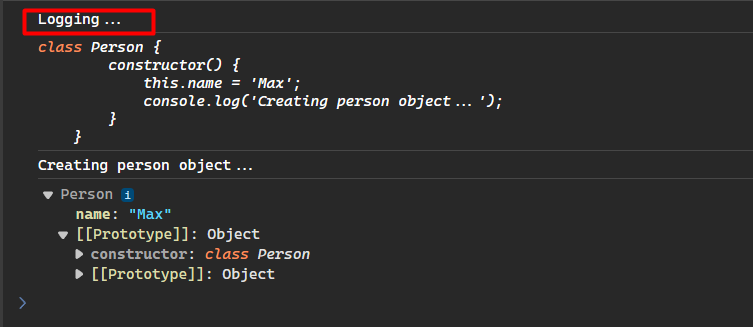

# Chapter 8: Decorators

- [Chapter 8: Decorators](#chapter-8-decorators)
  - [What is Decorators](#what-is-decorators)
  - [How to Enable](#how-to-enable)
  - [Class Decorator](#class-decorator)
  - [Decorator Factories](#decorator-factories)
  - [Method Decorators](#method-decorators)
  - [Property Decorators](#property-decorators)
  - [Parameter Decorators](#parameter-decorators)
  - [Accessor Decorators](#accessor-decorators)
  - [Adding Multiple Decorators](#adding-multiple-decorators)
  - [Validation Decorators](#validation-decorators)
  - [Custom Validation Decorators](#custom-validation-decorators)


## What is Decorators

Decorators in TypeScript are a powerful feature that allows developers to annotate and modify class declarations, methods, properties, accessors, and parameters. They are a programming design pattern where you wrap something to change its behavior. This feature is currently at stage three in JavaScript and has been adopted in TypeScript since version 5.0, aligning with the ECMAScript stage three proposal. Decorators are not new; several programming languages, such as Python, Java, and C#, have adopted this pattern before JavaScript. They provide a meta-programming syntax for class declarations and members, making it easier to implement and understand

In TypeScript, a Decorator is a special kind of declaration that can be attached to a class declaration, method, accessor, property, or parameter. Decorators use the form `@expression`, where expression must evaluate to a function that will be called at runtime with information about the decorated declaration.

**Benefits**

- **Metadata Addition**: Decorators provide a way to add metadata to classes, properties, methods, and parameters, making it easier to maintain and understand the code.
- **Behavior Modification**: They allow for the modification of behavior, enabling developers to add functionality to existing classes, properties, methods, and parameters.
- **Code Readability and Maintainability**: By providing a clear and concise way to add information and functionality, decorators can make your code more readable, maintainable, and modular.
- **Type Safety**: With the new decorator implementation in TypeScript 5.0, decorators are now type-safe, making it easier to implement and understand 34.


**Use Cases**
- **Framework Integration**: Decorators are widely used in frameworks like Angular for dependency injection, routing, and more.
- **Metadata Generation**: They can be used to generate metadata for classes, properties, methods, and parameters, which can be useful for documentation, validation, or other purposes.
- **Aspect-Oriented Programming**: Decorators can be used to implement aspect-oriented programming patterns, such as logging, caching, or transaction management, by adding behavior to methods or classes without modifying their code

## How to Enable

To enable experimental support for decorators in TypeScript, you must enable the experimentalDecorators compiler option either on the command line or in your tsconfig.json file.

```TypeScript
{
  "compilerOptions": {
    "target": "ES6",
    "experimentalDecorators": true
  }
}
```

> [!NOTE]
> Decorator Factories names are commonly defined with capital letters, e.g. Color, Logger, etc.

> [!IMPORTANT]
> Most decorators cannot be used in a [declaration file](https://www.typescriptlang.org/docs/handbook/2/type-declarations.html), or in any other ambient context (such as in a declare class).

## Class Decorator

A Class Decorator is declared just before a class declaration. The class decorator is applied to the constructor of the class and can be used to observe, modify, or replace a class definition. 

The expression for the class decorator will be called as a function at runtime, with the **constructor** of the decorated class as its only argument.

If the class decorator returns a value, it will replace the class declaration with the provided constructor function.

**Syntax**

```TypeScript
function ClassDecorator<T extends { new(...args: any[]): {} }>(constructor: T) {
    // ... logic here
}
```

**Example**

```TypeScript
// Logger decorator
function Logger(target: Function) {
  console.log('Logging...');
  console.log(target);
}

@Logger // this will apply the decorator to the class definition
class Person {
  name = 'Max';

  constructor() {
    console.log('Creating person object...');
  }
}

const person = new Person();
console.log(person);
```

If you run this code in a browser, you will see "Logging..." was printed to the console. What happened here is that the decorator function was executed just **before the class was defined**.



For class decorators, the received parameter is a constructor function.

## Decorator Factories

Decorator factories are functions that return a decorator function. This allows for the creation of more flexible and configurable decorators by accepting parameters and customizing their behavior based on those parameters. By using decorator factories, decorators can be dynamically configured and applied to different scenarios, providing a higher level of customization and reusability.

The use of decorator factories enables the creation of decorators with varying behavior based on the parameters passed to the factory function. This allows for the creation of more versatile and configurable decorators, providing the ability to customize the behavior of the decorator based on specific requirements.

**Syntax**

```TypeScript
function DecoratorFactory(params: any): ClassDecorator | MethodDecorator | PropertyDecorator {
    return function(target: any, propertyKey?: string | symbol, descriptor?: PropertyDescriptor) {
        // ... logic here
    }
}
```

**Example**

```TypeScript
// You can specify parameters on the Decorator Factory to be used when applied to the target (e.g. classes, methods and parameters).
function Logger(LogString: string) {
  return function (constructor: Function) {
    console.log(logString); // here we are using the factory parameter
    console.log(constructor);
  };
}

// This is how we pass values to the decorator factory.
@Logger('LOGGING - PERSON')
class Person {
  name = 'Max';

  constructor() {
    console.log('Creating person object...');
  }
}
const person = new Person();
console.log(person);
```

Decorator factories aren't called directly. Instead we use the `@decoratorName` syntax just above the place where it should be applied (classes, methods, and properties). 

When we call the decorator factory, we are not executing the decorator itself. We are execution a function that will return a decorator function. The advantage is that we can pass values to be used inside the returned decorator function.


## Method Decorators

A Method Decorator is declared just before a method declaration. The decorator is applied to the Property Descriptor for the method, and can be used to observe, modify, or replace a method definition.

The expression for the method decorator will be called as a function at runtime, with the following three arguments:

1. Either the constructor function of the class for a static member, or the prototype of the class for an instance member.
2. The name of the member.
3. The Property Descriptor for the member.

> [!NOTE]
> The Property Descriptor will be undefined if your script target is less than ES5.

If the method decorator returns a value, it will be used as the Property Descriptor for the method.

> [!NOTE]
> The return value is ignored if your script target is less than ES5.

**Syntax**

```TypeScript
function MethodDecorator(target: any, propertyKey: string | symbol, descriptor: PropertyDescriptor): void {
    // ... logic here
}
```

**Example**

```TypeScript
function LogMethod(target: any, propertyKey: string, descriptor: PropertyDescriptor) {
  console.log(`Method "${propertyKey}" has been decorated`);
}
class MyClass {
  @LogMethod
  myMethod() {
    // Method logic here
  }
}
```

In this example, the `LogMethod` function is a method decorator that logs a message when a method is decorated within the `MyClass` class.

Method decorators provide a way to observe, modify, or replace the definition of a method within a class. They are applied using the `@expression` syntax and are called at runtime with information about the decorated method, allowing for customization and additional functionality based on the methods being decorated.

## Property Decorators

A Property Decorator is declared just before a property declaration.

The expression for the property decorator will be called as a function at runtime, with the following two arguments:

1. Either the constructor function of the class for a static member, or the prototype of the class for an instance member.
2. The name of the member.

> [!IMPORTANT]
> A Property Descriptor is not provided as an argument to a property decorator due to how property decorators are initialized in TypeScript. This is because there is currently no mechanism to describe an instance property when defining members of a prototype, and no way to observe or modify the initializer for a property. The return value is ignored too. As such, a property decorator can only be used to observe that a property of a specific name has been declared for a class.

**Syntax:**

```TypeScript
function PropertyDecorator(target: any, propertyKey: string | symbol): void {
    // ... logic here
}
```

**Example:**

```TypeScript
function LogProperty(target: any, propertyKey: string) {
  console.log(`Property "${propertyKey}" has been declared`);
}

class MyClass {
  @LogProperty
  myProperty: string;
}

```

In this example, the `LogProperty` function is a property decorator that logs a message when a property is declared within the `MyClass` class.

Property decorators provide a way to observe the declaration of a property within a class and can be used to perform actions or add behavior based on the properties being declared.

These decorators are applied using the `@expression` syntax and are called at runtime with information about the decorated property, allowing for customization and additional functionality based on the properties being decorated.

## Parameter Decorators

Parameter decorators in TypeScript allow observing parameters of methods and functions. They are defined similarly to method and property decorators, using the `@expression` syntax.

The parameter decorator function is called with information about the target, name of the property containing the method, and index of the decorated parameter.

The expression for the parameter decorator will be called as a function at runtime, with the following three arguments:

1. Either the constructor function of the class for a static member, or the prototype of the class for an instance member.
2. The name of the member.
3. The ordinal index of the parameter in the function’s parameter list.

> [!NOTE]
> A parameter decorator can only be used to observe that a parameter has been declared on a method.

The return value of the parameter decorator is ignored.

**Example**

```TypeScript
function LogParam(target: any, methodName: string, paramIndex: number) {
  console.log('Parameter ' + paramIndex + ' of method ' + methodName + ' has been decorated');
}
class MyClass {
  myMethod(@LogParam param: string) {
    // ...
  }
}
```

In this example, the `LogParam` decorator logs information about the decorated parameter of `MyClass.myMethod()`.

Parameter decorators allow customizing parameter behavior or adding functionality based on parameter declarations. They are initialized at runtime with data about the target, method name, and parameter index.

## Accessor Decorators

An Accessor Decorator is declared just before an accessor declaration. The accessor decorator is applied to the Property Descriptor for the accessor and can be used to observe, modify, or replace an accessor’s definitions.

Property decorators in TypeScript are used to observe that a property of a specific name has been declared for a class. They are a special kind of declaration that can be attached to a property and are denoted by the @expression syntax, where the expression must evaluate to a function that will be called at runtime with information about the decorated property.

> [!NOTE]
> One important point to note is that a property descriptor is not provided as an argument to a property decorator due to how property decorators are initialized in TypeScript. This is because there is currently no mechanism to describe an instance property when defining members of a prototype, and no way to observe or modify the initializer for a property. The return value of a property decorator is also ignored. As such, a property decorator can only be used to observe that a property of a specific name has been declared for a class.

The expression for the accessor decorator will be called as a function at runtime, with the following three arguments:

1. Either the constructor function of the class for a static member, or the prototype of the class for an instance member.
2. The name of the member.
3. The Property Descriptor for the member.

> [!NOTE]
> The Property Descriptor will be undefined if your script target is less than ES5.

If the accessor decorator returns a value, it will be used as the Property Descriptor for the member.

> [!NOTE]
>  The return value is ignored if your script target is less than ES5.

**Syntax**

```TypeScript
function AccessorDecorator(target: any, propertyKey: string, descriptor: PropertyDescriptor) {
    // ... logic here
}
```

**Example**

```TypeScript
function LogAccessor(target: any, propertyKey: string, descriptor: PropertyDescriptor) {
  console.log(`Accessor "${propertyKey}" in class "${target.constructor.name}" has been decorated`);
}
class MyClass {
  private _value: number = 0;

  @LogAccessor
  get value(): number {
    return this._value;
  }

  set value(newValue: number) {
    this._value = newValue;
  }
}
```

In this example, the `LogAccessor` decorator logs a message when the value accessor of the `MyClass` class is decorated.

Accessor decorators provide a way to observe, modify, or replace the definitions of accessors in TypeScript. They are applied using the @expression syntax and are called at runtime with information about the decorated accessor.


## Adding Multiple Decorators

Multiple decorators can be applied to a declaration.

The following steps are performed when evaluating multiple decorators on a single declaration in TypeScript:

1. The expressions for each decorator factory are evaluated top-to-bottom.
2. The results are then called as functions from bottom-to-top.

We can observe this evaluation order with the following example:

```TypeScript
function first() {
  console.log("first(): factory evaluated");
  return function (target: any, propertyKey: string, descriptor: PropertyDescriptor) {
    console.log("first(): called");
  };
} 
function second() {
  console.log("second(): factory evaluated");
  return function (target: any, propertyKey: string, descriptor: PropertyDescriptor) {
    console.log("second(): called");
  };
}
 
class ExampleClass {
  @first()
  @second()
  method() {}
}
```

Which would print this output to the console:

```bash
first(): factory evaluated
second(): factory evaluated
second(): called
first(): called
```

There is a well defined order to how decorators applied to various declarations inside of a class are applied:

1. Parameter Decorators, followed by Method, Accessor, or Property Decorators are applied for each **instance member**.
2. Parameter Decorators, followed by Method, Accessor, or Property Decorators are applied for each **static member**.
3. Parameter Decorators are applied for the **constructor**.
4. Class Decorators are applied for the **class**.

## Validation Decorators

Validator decorators in TypeScript are used to apply validation rules to class properties, methods, or accessors. They are part of the class-validator library and are applied using the @ syntax. Here's the syntax and an example:

```TypeScript
import { IsString, IsInt, MinLength, MaxLength } from 'class-validator';

class MyClass {
  @IsString()
  propertyName: string;

  @IsInt()
  methodWithNumberParam(@MinLength(3) param: string) {
    // ...
  }
}
```

In this example, the `@IsString()` decorator is used to ensure that the `propertyName` property is a string, and the `@IsInt()` and `@MinLength(3)` decorators are used to validate the parameter of the `methodWithNumberParam` method.

The `class-validator` library provides a variety of built-in decorators such as `IsString`, `IsInt`, `MinLength`, `MaxLength`, and many more, allowing for easy and expressive validation rules to be applied to class members.

## Custom Validation Decorators

Creating custom validation decorators in TypeScript using the class-validator library involves defining a decorator function that registers a custom validation constraint. This process can be broken down into two main steps: defining the custom validation logic and applying the decorator to a class property.

First, you need to define the custom validation logic. This involves creating a function that implements the validation logic and then registering it as a decorator using `registerDecorator` from `class-validator`. Here's an example of a custom decorator named `@IsLongerThan` that checks if a string is longer than another property's string length:

```TypeScript
import { registerDecorator, ValidationOptions, ValidationArguments } from 'class-validator';

export function IsLongerThan(property: string, validationOptions?: ValidationOptions) {
 return function (object: Object, propertyName: string) {
    registerDecorator({
      name: 'isLongerThan',
      target: object.constructor,
      propertyName: propertyName,
      constraints: [property],
      options: validationOptions,
      validator: {
        validate(value: any, args: ValidationArguments) {
          const [relatedPropertyName] = args.constraints;
          const relatedValue = (args.object as any)[relatedPropertyName];
          return typeof value === 'string' && typeof relatedValue === 'string' && value.length > relatedValue.length;
        },
      },
    });
 };
}
```

After defining the custom validation logic, you can apply the decorator to a class property. Here's how you can use the `@IsLongerThan` decorator in a class:

```TypeScript
import { IsLongerThan } from './IsLongerThan';

export class Post {
 title: string;

 @IsLongerThan('title', {
    message: 'Text must be longer than the title',
 })
 text: string;
}
```

In this example, the `@IsLongerThan` decorator is applied to the text property of the `Post` class. It checks if the text is longer than the title property. The message option is used to customize the error message when the validation fails.

Custom validation decorators in TypeScript, especially when using libraries like class-validator, are particularly useful in scenarios where the built-in validation constraints do not meet your specific validation requirements. Here are some common scenarios where you might consider using a custom validation decorator:

1. **Complex Validation Logic**: When your validation logic is too complex or cannot be easily expressed using the built-in constraints provided by class-validator or similar libraries, a custom decorator allows you to encapsulate this logic in a reusable and declarative manner.

2. **Cross-Field Validation**: If you need to validate a property based on the value of another property within the same object, custom validation decorators are essential. For example, ensuring that a password confirmation field matches the original password field.

3. **External Data Validation**: When your validation logic depends on external data sources or services (e.g., checking if a username is already taken in a database), custom decorators can be used to perform these asynchronous checks.

4. **Domain-Specific Validation**: If your application has specific business rules or domain-specific validation requirements that are not covered by the standard validation constraints, custom decorators provide a way to implement these rules in a clean and maintainable way.

5. **Reusable Validation Logic**: If you find yourself repeating the same validation logic across multiple properties or classes, encapsulating this logic in a custom decorator allows you to reuse it easily, reducing code duplication and improving maintainability.

6. **Custom Error Messages**: While class-validator allows you to customize error messages for built-in constraints, custom decorators give you full control over the validation process, including the ability to customize error messages based on the specific validation logic.

7. **Integration with External Libraries**: If you're using external libraries for validation that are not directly supported by class-validator, custom decorators can serve as an adapter, allowing you to integrate these libraries seamlessly into your validation process.

8. **Performance Optimization**: In some cases, you might want to perform validation only under certain conditions or optimize the validation process by combining multiple checks into a single custom decorator.

**Conclusion**

Custom validation decorators are a powerful tool in TypeScript, especially when working with object-oriented programming and validation libraries like class-validator. They allow for greater flexibility, reusability, and maintainability in your validation logic, making them an essential part of many complex applications.

---

[[<< Previous]](../Chapter-07/README.md) [[^Top]](#chapter-8-decorators) [[Next >>]](../Chapter-09/README.md)